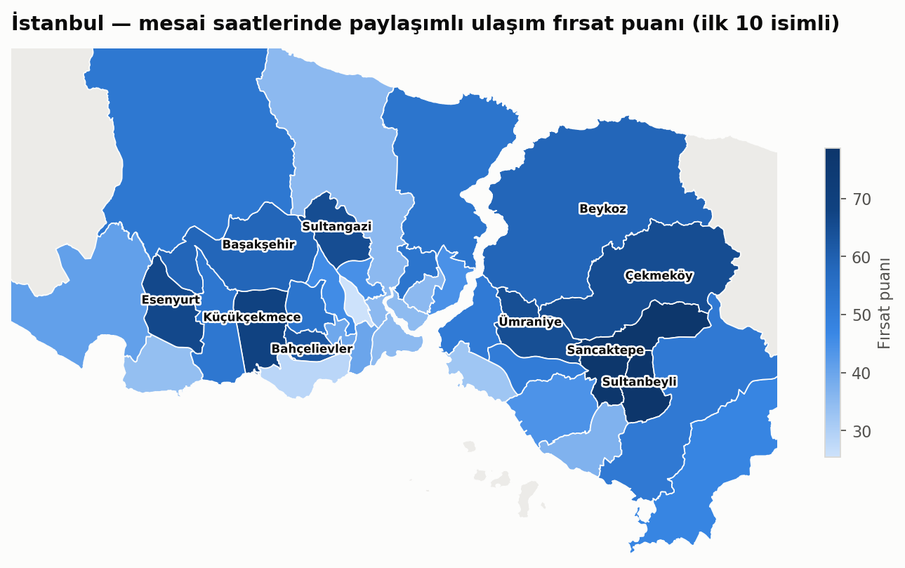
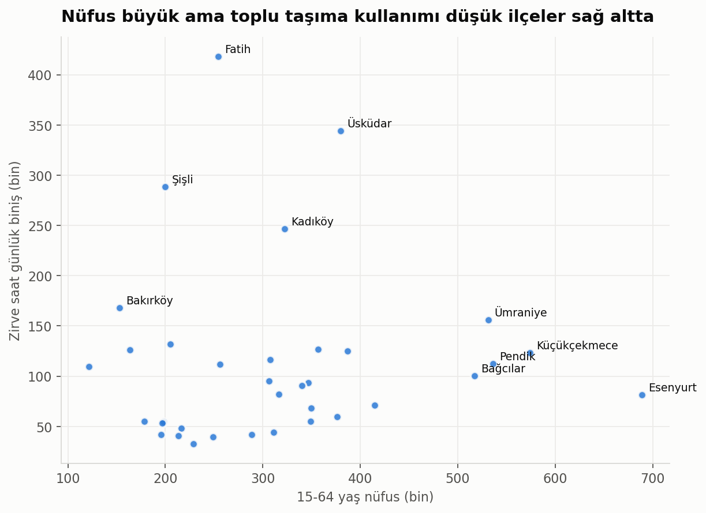
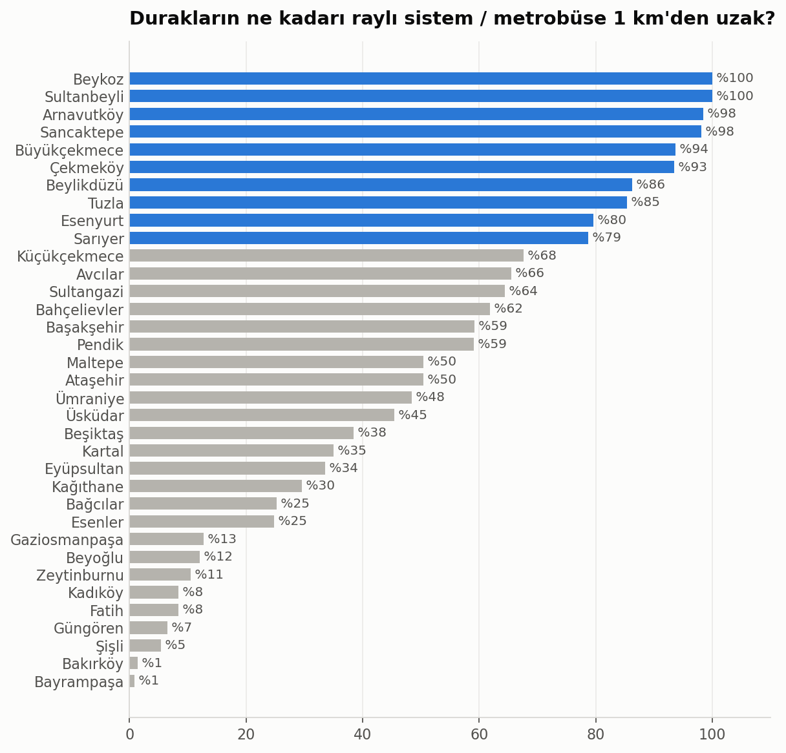
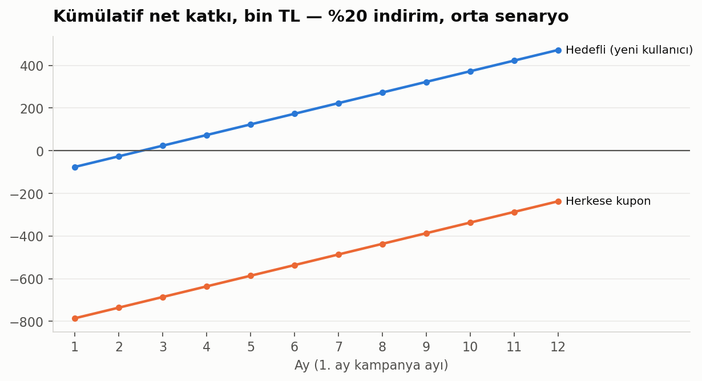

# İstanbul'da Toplu Taşımanın Yetmediği Yerler
### Mesai saatlerinde paylaşımlı ulaşım için fırsat haritası

> **Soru:** İstanbul'da insanlar işe gidip gelirken toplu taşımayı nerede bırakıp bir alternatife (scooter, e-bisiklet, paylaşımlı araç) geçmeye en yatkın? Bir paylaşımlı ulaşım şirketi indirim kuponlarını nereye, kime ve ne kadar vermeli?

**Veri:** 6 ay (Ekim 2023 – Mart 2024), **~870 milyon** hafta içi toplu taşıma binişi, 15 bin otobüs durağı, 358 istasyon ve saatlik trafik verisi. Kaynakların tamamı İBB Açık Veri Portalı.
**Araçlar:** SQL (DuckDB) · Python (pandas, geopandas) · matplotlib · folium · scipy/statsmodels

<sub>🇬🇧 *English summary: Using ~870M public transit trips from Istanbul's open data portal, this project scores 35 districts on where commuters are most underserved by transit during work hours (access gaps, crowded buses, commuter demand, price sensitivity), recommends the right shared-mobility product per district, simulates the ROI of targeted vs. blanket discount coupons, and designs an A/B test to measure the campaign.*</sub>



---

## Ana bulgular

**1. En büyük fırsat İstanbul'un dış çeperindeki kalabalık ilçelerde.** Sultanbeyli, Sancaktepe, Küçükçekmece, Esenyurt ve Sultangazi ilk 5'te. Bu ilçelerde hem nüfus büyük hem de toplu taşıma erişimi zayıf.

| # | İlçe | Fırsat puanı | İstasyona medyan mesafe | Önerilen alternatif |
|---|---|---|---|---|
| 1 | Sultanbeyli | 78,7 | 6,4 km | Paylaşımlı araç / mikro-servis |
| 2 | Sancaktepe | 77,9 | 5,0 km | Paylaşımlı araç / mikro-servis |
| 3 | Küçükçekmece | 68,1 | 1,6 km | Scooter / e-bisiklet |
| 4 | Esenyurt | 66,4 | 2,5 km | Scooter / e-bisiklet |
| 5 | Sultangazi | 65,1 | 1,3 km | Scooter / e-bisiklet |
| 6 | Çekmeköy | 65,1 | 4,3 km | Paylaşımlı araç / mikro-servis |
| 7 | Ümraniye | 64,6 | 1,0 km | Scooter / e-bisiklet |
| 8 | Bahçelievler | 62,7 | 1,3 km | Scooter / e-bisiklet |
| 9 | Başakşehir | 58,5 | 1,3 km | Scooter / e-bisiklet |
| 10 | Beykoz | 58,4 | 7,0 km | Paylaşımlı araç / mikro-servis |

**2. Sıralama ağırlık seçimine bağlı değil.** 5.000 farklı ağırlık kombinasyonuyla yapılan duyarlılık analizinde ilk 8 ilçe, denemelerin en az %94'ünde ilk 10'da kaldı.

**3. Kalabalık ilçelerde toplu taşıma kullanımı düşük ve bunun önemli bir sebebi erişim.** Esenyurt, İstanbul'un en kalabalık ilçesi; ama burada çalışma çağındaki kişi başına günde 0,12 zirve binişi düşüyor. Fatih'te bu oran 1,6. İstasyona uzaklık ile kişi başı kullanım arasında orta-güçlü negatif ilişki var (Spearman ρ ≈ −0,54).

<p float="left">
  
  
</p>

**4. Tek bir çözüm yok: ilçeye göre doğru ürün değişiyor.**
- İstasyona **3 km'den uzak** ilçelerde (Sultanbeyli, Sancaktepe, Çekmeköy, Beykoz) scooter mesafesi uzun kalıyor. Burada istasyona **paylaşımlı araç / mikro-servis** önerilir.
- Zirve saatte ortalama hızın **30 km/s'in altına** düştüğü ilçelerde (Kadıköy, Şişli, Bahçelievler, Güngören) araçlar trafikte kalıyor. Burada **scooter / e-bisiklet** önerilir.

**5. Kupon herkese değil, hedefli verilmeli.** Herkese verilen kupon, zaten kullanan müşterilere de indirim yaptığı için (yamyamlaşma) 9 senaryonun 6'sında 12 ay sonunda hâlâ zararda. Sadece yeni kullanıcıya, zirve saatte ve hedef ilçede verilen **%20'lik kupon**, orta senaryoda **3. ayda** kendini amorti ediyor.



**6. Etki 8 haftalık bir A/B testiyle ölçülmeli.** Kullanıcı bazında rastgele atama yapılır ve ana metrik "ilk 4 haftada zirve saat yolculuğu yapma oranı" olur. Bu metrikte +%15'lik bir etkiyi yakalamak için yaklaşık 11 bin kullanıcı gerekiyor.

---

## Yöntem

```
 İBB Açık Veri (~9 GB CSV)          GTFS · istasyonlar · nüfus · trafik · sosyal yardım
          │                                          │
          ▼                                          ▼
 SQL ile hafta içi 07-20'ye indirgeme      Koordinat/karakter temizliği,
 (sql/01, ~9 GB → 108 MB parquet)          durakları ilçelere bağlama
          └──────────────┬───────────────────────────┘
                         ▼
          İlçe ölçütleri (sql/03-06, src/metrics.py)
          talep · erişim · otobüs yükü · trafik · gelir
                         ▼
          Fırsat puanı + duyarlılık analizi + alternatif önerisi
                         ▼
          Kupon simülasyonu  →  A/B testi tasarımı
```

### Fırsat puanının bileşenleri

| Bileşen | Ölçüt | Ağırlık |
|---|---|---|
| Talep | 15-64 yaş nüfus (%70) + abonmanlı biniş payı (%30) | %30 |
| Erişim açığı | Otobüs duraklarının raylı sistem/metrobüse 1 km'den uzak olanlarının payı | %30 |
| Konfor açığı | Zirve saat otobüs yük göstergesi (sefer başına biniş / kapasite) | %25 |
| Kupon duyarlılığı | Bin kişide sosyal yardım alan hane | %15 |

Her ölçüt 0-100 arasına ölçeklenir. Kırsal ilçeler (Silivri, Şile, Çatalca) ve Adalar kapsam dışı.

### Yol boyunca verilen önemli kararlar
- **Otobüs binişlerini ilçeye bağlama.** Ham verideki ilçe alanı normal otobüslerde biniş yerini göstermiyor (500T yolcularının %95'i "Bakırköy" olarak kayıtlı). Bu yüzden her hattın yolcusu, GTFS'teki duraklarının ilçelere dağılımına göre paylaştırıldı. Yolcuların ~%92'si bir ilçeye bağlanabildi.
- **Aktarma oranı puandan çıkarıldı.** Aktarmanın *yapıldığı* yeri gösterdiği için Fatih gibi aktarma merkezlerinde yüksek, yolculuğun başladığı ilçelerde düşük çıkıyor. Yani "bu ilçede yaşayanlar zorlanıyor mu?" sorusunu cevaplamıyor.
- **Otobüs yükü saat yerine zaman dilimiyle hesaplandı.** Saatlik hesapta sefer ve yolcu saatleri kayıyor (ör. 36L hattı 08:00'de 6 kat dolu görünüyordu). 3-4 saatlik dilimler bu kaymayı dengeliyor.
- **"Çalışan nüfus" için dolaylı gösterge kullanıldı.** Mahalle ya da ilçe bazında istihdam verisi yayınlanmıyor. Bunun yerine 15-64 yaş nüfus ve abonmanlı biniş payı (düzenli işe/okula gidiş) kullanıldı.

## Sınırlamalar
- **Otobüs yükü gerçek doluluk değil.** Biniş sayısı, aynı anda araçtaki kişi sayısı değildir; ölçüt hatları kendi aralarında karşılaştırmak içindir. Kapasite ortalama 100 kişi varsayıldı.
- **Sefer planı 2026'ya ait, yolcu verisi 2023-24'e.** İBB yalnızca güncel GTFS'i yayınlıyor. Hatların ~%8'i eşleşmedi.
- **İlçe düzeyi kaba bir çözünürlük.** Aynı ilçe içinde metroya yakın ve uzak mahalleler var. Sıradaki adım mahalle düzeyine inmek.
- **Kupon simülasyonu varsayımlara dayanıyor.** Fiyat, marj, fiyat esnekliği ve kalıcılık gerçek şirket verisi değil. Tüm varsayımlar [04 numaralı notebook](notebooks/04_kupon_simulasyonu.ipynb)'ta tek hücrede ve değiştirilebilir. A/B testindeki örnek veri sentetiktir.
- **Korelasyon nedensellik değildir.** Düşük toplu taşıma kullanımında gelir ve özel araç sahipliği de rol oynuyor olabilir.

## Notebook'lar

| # | Notebook | İçerik |
|---|---|---|
| 01 | [Veri hazırlama](notebooks/01_veri_hazirlama.ipynb) | Kaynaklar, veri hattı, kalite kontrolleri |
| 02 | [Keşifsel analiz](notebooks/02_kesifsel_analiz.ipynb) | Saatlik talep, ilçeler, erişim, otobüs yükü, trafik, korelasyonlar |
| 03 | [Fırsat puanı](notebooks/03_firsat_puani.ipynb) | Puanlama, duyarlılık analizi, alternatif önerisi, harita |
| 04 | [Kupon simülasyonu](notebooks/04_kupon_simulasyonu.ipynb) | Hedefli ve herkese kupon karşılaştırması, amorti süresi |
| 05 | [A/B testi](notebooks/05_ab_testi.ipynb) | Deney tasarımı, örneklem büyüklüğü, analiz örneği |

İnteraktif harita: [images/firsat_haritasi.html](images/firsat_haritasi.html) (indirip tarayıcıda açın)

## Proje yapısı

```
sql/          01-06  SQL sorguları (DuckDB): veri indirgeme ve ilçe ölçütleri
src/          Python: veri indirme, temizleme, coğrafi ölçütler, grafik stili
notebooks/    01-05  analiz adımları
data/processed/      ilçe ölçütleri, fırsat puanları, referans ve trafik verileri
images/              grafikler ve interaktif harita
```

## Çalıştırma

```bash
pip install -r requirements.txt
python src/download_external.py     # küçük veri setleri (~30 MB)
python src/build_monthly.py         # 6 aylık toplu taşıma + trafik (~9 GB indirilir, işlenir, silinir; ~5 dk)
python src/build_reference.py       # GTFS, istasyon, nüfus temizliği
jupyter notebook notebooks/
```

## Veri kaynakları ve lisans
- [İBB Açık Veri Portalı](https://data.ibb.gov.tr): Saatlik Toplu Ulaşım, İETT GTFS, Raylı Sistem İstasyonları, Saatlik Trafik Yoğunluğu, Nüfus Bilgileri, Mahallelere Göre Sosyal Yardım
- İlçe sınırları: © [OpenStreetMap](https://www.openstreetmap.org/copyright) katkıcıları (ODbL), [sahircansurmeli/istanbul-geojson](https://github.com/sahircansurmeli/istanbul-geojson) üzerinden

---

**Yusuf Yücel** · [GitHub](https://github.com/yusufyucell)
